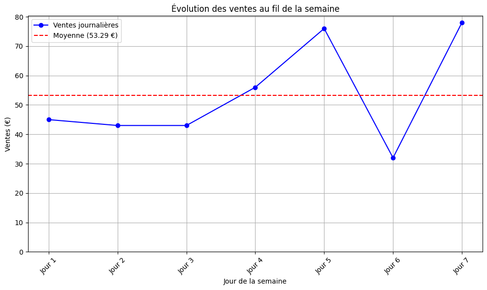
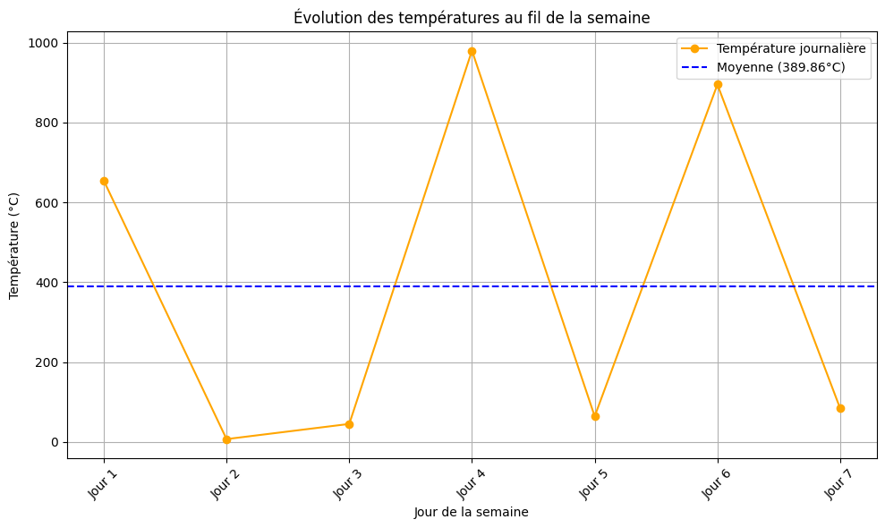
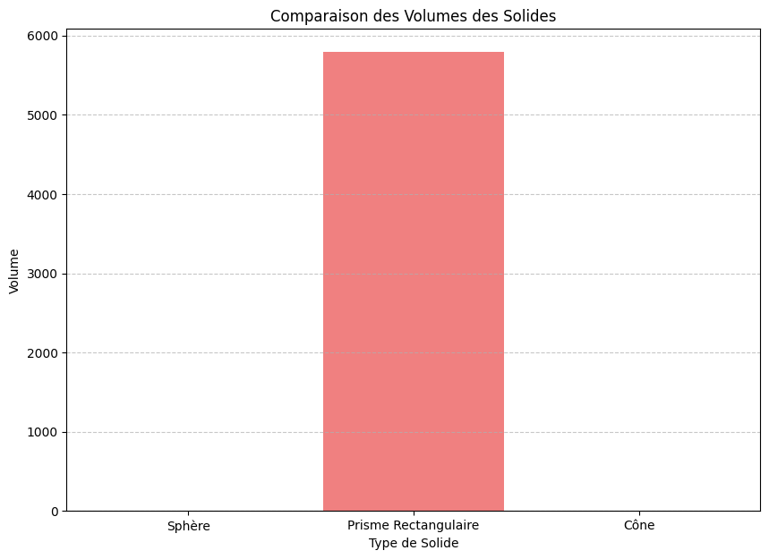
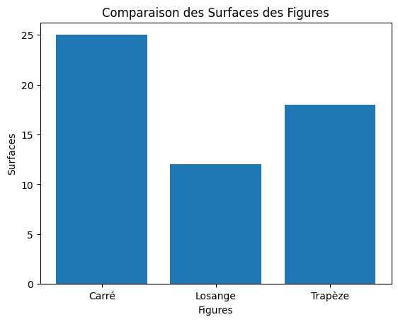

# Institut Universitaire des Sciences - IUS
## Faculté des Sciences et Technologie - FST

### Niveau L3 FST

### Rapport du td 2 dans le cadre du cours Math - Info

### Soumis au chargé de cours Ismael SAINT AMOUR

### Préparé par Robaldo BADIO

#### Date Le 2 Juin 2025

## Execution du TD

### Exercice 1 : Saisie des Ventes d’un Magasin et Graphe en Ligne


```python
Demander à l’utilisateur d’entrer les ventes d’un magasin pour 7 jours.
Calculer le total et la moyenne des ventes.
Afficher un graphe en ligne montrant l’évolution des ventes au fil de la semaine.
```


```python
import matplotlib.pyplot as plt

ventes_journalieres = []
somme = 0

print("Veuillez entrer les ventes de votre magasin pour les 7 derniers jours.")

for i in range(7):
    while True:
        try:
            jour_vente = float(input(f"Entrer la vente du jour {i+1} : "))
            if jour_vente < 0:
                print("Les ventes ne peuvent pas être négatives. Veuillez réessayer.")
            else:
                ventes_journalieres.append(jour_vente)
                somme += jour_vente
                break
        except ValueError:
            print("Entrée invalide. Veuillez entrer un nombre pour les ventes.")

print(f"\nLe total des ventes est : {somme:.2f} €")
moyenne = somme / 7
print(f"La moyenne des ventes est : {moyenne:.2f} €")


## Évolution des ventes au fil de la semaine

jours = [f"Jour {i+1}" for i in range(len(ventes_journalieres))]

plt.figure(figsize=(10, 6))

plt.plot(jours, ventes_journalieres, marker='o', linestyle='-', color='b', label='Ventes journalières')

plt.axhline(y=moyenne, color='r', linestyle='--', label=f'Moyenne ({moyenne:.2f} €)')

plt.xlabel("Jour de la semaine")
plt.ylabel("Ventes (€)")
plt.title("Évolution des ventes au fil de la semaine")
plt.legend()
plt.grid(True)
plt.ylim(bottom=0)
plt.xticks(rotation=45)
plt.tight_layout()
plt.show()
```

    Veuillez entrer les ventes de votre magasin pour les 7 derniers jours.
    

    Entrer la vente du jour 1 :  45
    Entrer la vente du jour 2 :  43
    Entrer la vente du jour 3 :  43
    Entrer la vente du jour 4 :  56
    Entrer la vente du jour 5 :  76
    Entrer la vente du jour 6 :  32
    Entrer la vente du jour 7 :  78
    

    
    Le total des ventes est : 373.00 €
    La moyenne des ventes est : 53.29 €
    


    

    


### Exercice 2 : Évolution de la Température sur 7 Jours


```python
Demander à l’utilisateur d’entrer les températures journalières d’une semaine. Calculer la température moyenne. Afficher un graphe en ligne montrant l’évolution des températures.
```


```python
import matplotlib.pyplot as plt

# Liste pour stocker les températures journalières
temperatures_journalieres = []
somme_temperatures = 0

print("Veuillez entrer les températures journalières pour la semaine.")

for i in range(7):
    while True:
        try:
            temp_jour = float(input(f"Entrer la température du jour {i+1} (°C) : "))
            temperatures_journalieres.append(temp_jour)
            somme_temperatures += temp_jour
            break
        except ValueError:
            print("Entrée invalide. Veuillez entrer un nombre pour la température.")

# Calcul de la moyenne des températures
if len(temperatures_journalieres) > 0:
    moyenne_temperatures = somme_temperatures / len(temperatures_journalieres)
else:
    moyenne_temperatures = 0 # Cas où aucune température n'est entrée

print(f"\nLa température moyenne de la semaine est : {moyenne_temperatures:.2f} °C")


## Évolution des températures au fil de la semaine

# Créer une liste de labels pour l'axe des x
jours = [f"Jour {i+1}" for i in range(len(temperatures_journalieres))]

plt.figure(figsize=(10, 6))

# Tracer l'évolution des températures
plt.plot(jours, temperatures_journalieres, marker='o', linestyle='-', color='orange', label='Température journalière')

# Tracer la moyenne des températures
plt.axhline(y=moyenne_temperatures, color='blue', linestyle='--', label=f'Moyenne ({moyenne_temperatures:.2f}°C)')

plt.xlabel("Jour de la semaine")
plt.ylabel("Température (°C)")
plt.title("Évolution des températures au fil de la semaine")
plt.legend()
plt.grid(True)
# plt.ylim n'est pas strictement nécessaire pour les températures si on veut voir la variation,
# mais on peut l'ajouter si on veut fixer une échelle
# plt.ylim(bottom=-10, top=40) # Exemple de limites si besoin
plt.xticks(rotation=45)
plt.tight_layout()
plt.show()
```

    Veuillez entrer les températures journalières pour la semaine.
    

    Entrer la température du jour 1 (°C) :  654
    Entrer la température du jour 2 (°C) :  7
    Entrer la température du jour 3 (°C) :  45
    Entrer la température du jour 4 (°C) :  980
    Entrer la température du jour 5 (°C) :  64
    Entrer la température du jour 6 (°C) :  895
    Entrer la température du jour 7 (°C) :  84
    

    
    La température moyenne de la semaine est : 389.86 °C
    


    

    


### Exercice 3 : Simulation d’un Lancer de Pièces et Enregistrement en JSON


```python
Simuler un certain nombre de lancers de pièces (pile ou face).
Enregistrer les résultats dans un fichier JSON.
Afficher le nombre de fois où on obtient "Pile" et "Face".
```


```python
import random
import json

num_lancers = int(input("Entrez le nombre de lancers de pièces : "))
resultats = []
for _ in range(num_lancers):
    resultat = random.choice(["Pile", "Face"])
    resultats.append(resultat)

with open("resultats_lancers.json", "w") as f:
    json.dump(resultats, f)

num_pile = resultats.count("Pile")
num_face = resultats.count("Face")

print(f"Nombre de 'Pile' : {num_pile}")
print(f"Nombre de 'Face' : {num_face}")
```

    Entrez le nombre de lancers de pièces :  43
    

    Nombre de 'Pile' : 19
    Nombre de 'Face' : 24
    

### Exercice 4 : Calcul et Comparaison des Volumes de Solides


```python
Demander à l’utilisateur de choisir parmi trois solides :
Sphère → V=43πr3
Prisme Rectangulaire → V=L×l×h
Cône → V=13πr2h
Calculer et afficher le volume du solide choisi.
Afficher un graphe en barres comparant les volumes des solides.
```


```python
# import matplotlib.pyplot as plt
import math

def volume_sphere(radius):
    return (4/3) * math.pi * (radius ** 3)

def volume_prisme(length, width, height):
    return length * width * height

def volume_cone(radius, height):
    return (1/3) * math.pi * (radius ** 2) * height

volume_sphere_final = 0.0
volume_prisme_final = 0.0
volume_cone_final = 0.0

print("Entrez votre choix (1 pour une sphère, 2 pour un prisme rectangulaire, 3 pour un cône) :")
choice = 0
while True:
    try:
        choice = int(input("Votre choix : "))
        if 1 <= choice <= 3:
            break
        else:
            print("Choix invalide. Veuillez entrer 1, 2 ou 3.")
    except ValueError:
        print("Entrée invalide. Veuillez entrer un nombre.")

volume_solide_choisi = 0.0
nom_solide_choisi = ""

if choice == 1:
    nom_solide_choisi = "Sphère"
    print("\n--- Dimensions de la Sphère ---")
    while True:
        try:
            radius = float(input("Entrez le rayon de la sphère : "))
            if radius < 0:
                print("Le rayon ne peut pas être négatif. Réessayez.")
            else:
                volume_sphere_final = volume_sphere(radius)
                volume_solide_choisi = volume_sphere_final
                break
        except ValueError:
            print("Entrée invalide. Veuillez entrer un nombre.")
elif choice == 2:
    nom_solide_choisi = "Prisme Rectangulaire"
    print("\n--- Dimensions du Prisme Rectangulaire ---")
    while True:
        try:
            length = float(input("Entrez la longueur du prisme : "))
            if length < 0:
                print("La longueur ne peut pas être négative. Réessayez.")
            else:
                break
        except ValueError:
            print("Entrée invalide. Veuillez entrer un nombre.")
    while True:
        try:
            width = float(input("Entrez la largeur du prisme : "))
            if width < 0:
                print("La largeur ne peut pas être négative. Réessayez.")
            else:
                break
        except ValueError:
            print("Entrée invalide. Veuillez entrer un nombre.")
    while True:
        try:
            height = float(input("Entrez la hauteur du prisme : "))
            if height < 0:
                print("La hauteur ne peut pas être négative. Réessayez.")
            else:
                break
        except ValueError:
            print("Entrée invalide. Veuillez entrer un nombre.")
    volume_prisme_final = volume_prisme(length, width, height)
    volume_solide_choisi = volume_prisme_final
elif choice == 3:
    nom_solide_choisi = "Cône"
    print("\n--- Dimensions du Cône ---")
    while True:
        try:
            radius = float(input("Entrez le rayon du cône : "))
            if radius < 0:
                print("Le rayon ne peut pas être négatif. Réessayez.")
            else:
                break
        except ValueError:
            print("Entrée invalide. Veuillez entrer un nombre.")
    while True:
        try:
            height = float(input("Entrez la hauteur du cône : "))
            if height < 0:
                print("La hauteur ne peut pas être négative. Réessayez.")
            else:
                break
        except ValueError:
            print("Entrée invalide. Veuillez entrer un nombre.")
    volume_cone_final = volume_cone(radius, height)
    volume_solide_choisi = volume_cone_final
else:
    print("Choix invalide. Le programme va se terminer.")
    exit()

print(f"\nLe volume du {nom_solide_choisi} est : {volume_solide_choisi:.2f}")

solides_noms = ["Sphère", "Prisme Rectangulaire", "Cône"]
volumes_pour_graph = [volume_sphere_final, volume_prisme_final, volume_cone_final]

plt.figure(figsize=(10, 7))
plt.bar(solides_noms, volumes_pour_graph, color=['skyblue', 'lightcoral', 'lightgreen'])
plt.xlabel("Type de Solide")
plt.ylabel("Volume")
plt.title("Comparaison des Volumes des Solides")
plt.grid(axis='y', linestyle='--', alpha=0.7)
plt.show()
```

    Entrez votre choix (1 pour une sphère, 2 pour un prisme rectangulaire, 3 pour un cône) :
    

    Votre choix :  21
    

    Choix invalide. Veuillez entrer 1, 2 ou 3.
    

    Votre choix :  2
    

    
    --- Dimensions du Prisme Rectangulaire ---
    

    Entrez la longueur du prisme :  21
    Entrez la largeur du prisme :  23
    Entrez la hauteur du prisme :  12
    

    
    Le volume du Prisme Rectangulaire est : 5796.00
    


    

    


### Exercice 5 : Périmètre et Surface de Figures Géométriques


```python
Demander à l’utilisateur de choisir parmi trois figures :
Carré → Périmètre : P=4c, Surface : S=c*c
Losange → Périmètre : P=4c, Surface : S=D×d/2
Trapèze → Périmètre : P=a+b+c+d, Surface : S=(B+b)×h/2
Calculer et afficher le périmètre et la surface de la figure choisie.
Afficher un graphe comparant les surfaces des figures.
```


```python
import matplotlib.pyplot as plt # Présent dans plusieurs images

# --- Définition des fonctions pour le périmètre et la surface des figures ---

def carre_perimetre(cote):
    """Calcule le périmètre d'un carré."""
    return 4 * cote

def carre_surface(cote):
    """Calcule la surface d'un carré."""
    return cote * cote

def losange_perimetre(cote):
    """Calcule le périmètre d'un losange."""
    return 4 * cote

def losange_surface(grande_diagonale, petite_diagonale):
    """Calcule la surface d'un losange."""
    return (grande_diagonale * petite_diagonale) / 2

def trapeze_perimetre(a, b, c, d):
    """Calcule le périmètre d'un trapèze."""
    return a + b + c + d

def trapeze_surface(grande_base, petite_base, hauteur):
    """Calcule la surface d'un trapèze."""
    return (grande_base + petite_base) * hauteur / 2

# --- Demander à l'utilisateur de choisir une figure ---
print("Choisissez une figure :")
print("1. Carré")
print("2. Losange")
print("3. Trapèze")

choice = int(input("Entrez votre choix (1, 2 ou 3) : "))

# --- Initialisation des variables pour éviter des erreurs si non définies ---
perimetre = 0.0
surface = 0.0

# --- Obtenir les dimensions nécessaires en fonction du choix ---
if choice == 1:
    cote = float(input("Entrez la longueur du côté du carré : "))
    perimetre = carre_perimetre(cote)
    surface = carre_surface(cote)
elif choice == 2:
    cote = float(input("Entrez la longueur du côté du losange : ")) # Périmètre du losange
    grande_diagonale = float(input("Entrez la longueur de la grande diagonale du losange : "))
    petite_diagonale = float(input("Entrez la longueur de la petite diagonale du losange : "))
    perimetre = losange_perimetre(cote)
    surface = losange_surface(grande_diagonale, petite_diagonale)
elif choice == 3:
    a = float(input("Entrez la longueur du côté a du trapèze : "))
    b = float(input("Entrez la longueur du côté b du trapèze : "))
    c = float(input("Entrez la longueur du côté c du trapèze : "))
    d = float(input("Entrez la longueur du côté d du trapèze : "))
    grande_base = float(input("Entrez la longueur de la grande base du trapèze : "))
    petite_base = float(input("Entrez la longueur de la petite base du trapèze : "))
    hauteur = float(input("Entrez la hauteur du trapèze : "))
    perimetre = trapeze_perimetre(a, b, c, d)
    surface = trapeze_surface(grande_base, petite_base, hauteur)
else:
    print("Choix invalide.")
    exit() # Quitte le programme si le choix est invalide

# --- Afficher le périmètre et la surface de la figure choisie ---
print(f"Le périmètre de la figure est : {perimetre}")
print(f"La surface de la figure est : {surface}")

# --- Données pour le graphique en barres ---
figures = ["Carré", "Losange", "Trapèze"]
# Les surfaces sont ici des exemples de valeurs comme dans l'image.
# Si vous voulez que ces valeurs proviennent des calculs utilisateurs, il faudrait les stocker différemment.
# Pour le moment, je garde les exemples de l'image.
surfaces_pour_graphique = [carre_surface(5), losange_surface(6, 4), trapeze_surface(7, 5, 3)] # Exemple de valeurs

# --- Créer le graphique en barres ---
plt.bar(figures, surfaces_pour_graphique)
plt.xlabel("Figures")
plt.ylabel("Surfaces")
plt.title("Comparaison des Surfaces des Figures")
plt.show()
```

    Choisissez une figure :
    1. Carré
    2. Losange
    3. Trapèze
    

    Entrez votre choix (1, 2 ou 3) :  2
    Entrez la longueur du côté du losange :  2
    Entrez la longueur de la grande diagonale du losange :  4
    Entrez la longueur de la petite diagonale du losange :  6
    

    Le périmètre de la figure est : 8.0
    La surface de la figure est : 12.0
    


    

    


### En conclusion


#### J'ai appris les compétences de base en Programmation Mathématiques pour la science des données en python en utilisant Jupyter notebook.

#### Exemples Les variables en python, les variables multiples, et les types de données.


```python

```
