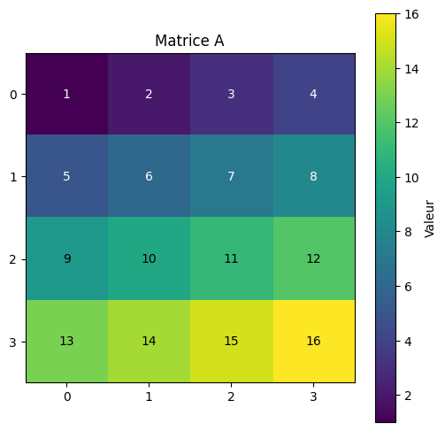
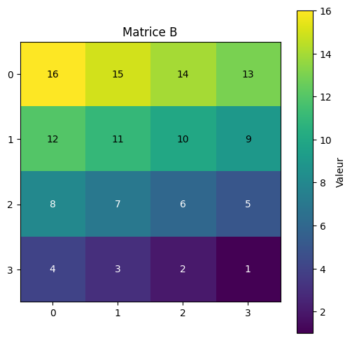
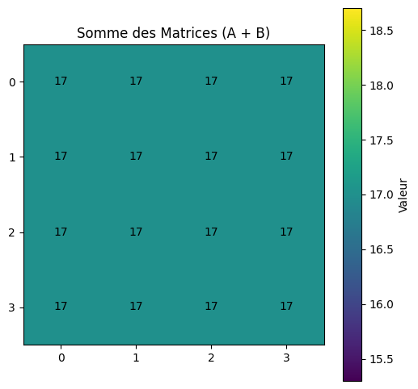
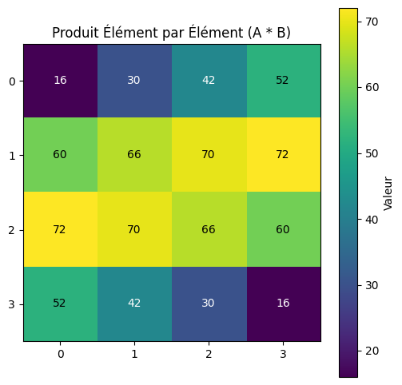
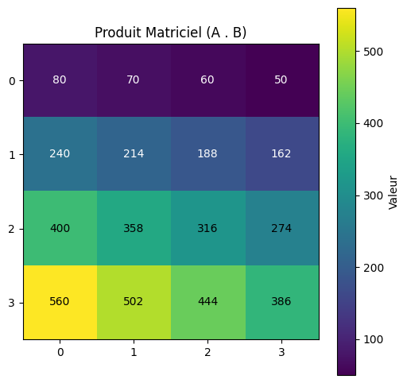
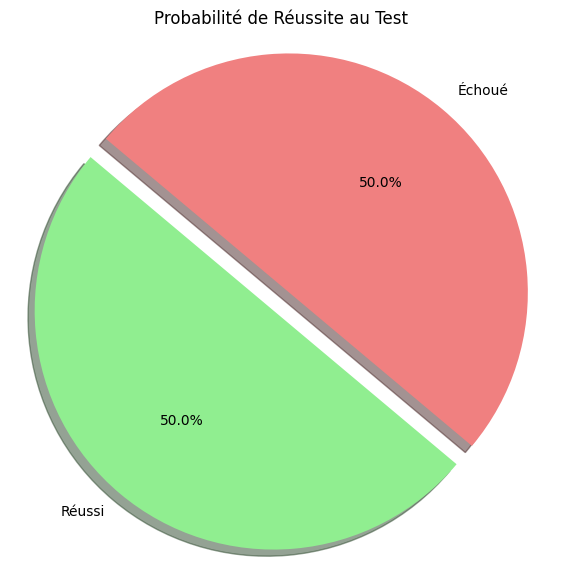
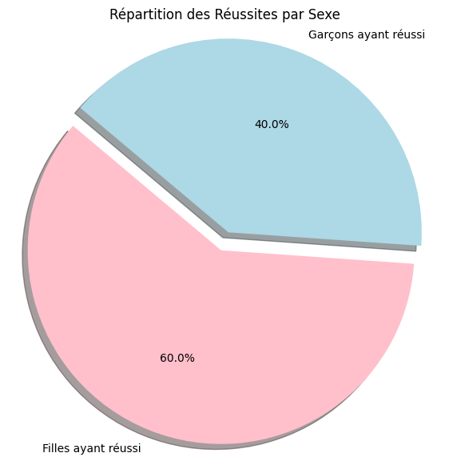
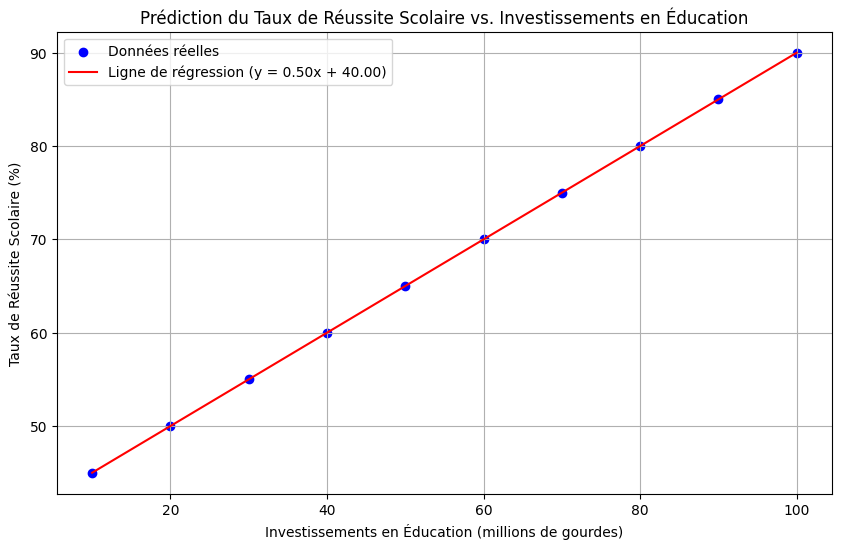
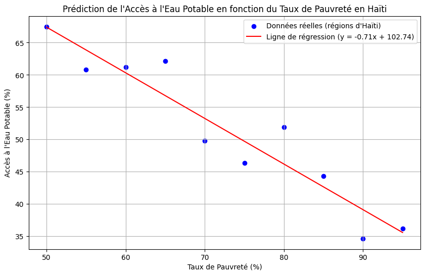

# Institut Universitaire des Sciences - IUS

## Faculté des Sciences et Technologie - FST

### Rapport du td 3 Math - Info

### Niveau L3 FST

### Soumis Au chargé de cours Ismael SAINT AMOUR

### Préparé par Robaldo BADIO

#### Date Le 7 juin 2025

# TP

## Exercice 1 — Matrices de base

Objectif : Créer deux matrices 4x4, puis :
Afficher leur somme
Calculer leur produit élément par élément
Calculer leur produit matriciel
Afficher les 3 résultats et Visualisation Graphique des Matrices


```python
import numpy as np
import matplotlib.pyplot as plt

# Objectif : Créer deux matrices 4x4

# Création de la première matrice 4x4
# Vous pouvez modifier les valeurs ici
matrice_A = np.array([
    [1, 2, 3, 4],
    [5, 6, 7, 8],
    [9, 10, 11, 12],
    [13, 14, 15, 16]
])

# Création de la deuxième matrice 4x4
# Vous pouvez modifier les valeurs ici
matrice_B = np.array([
    [16, 15, 14, 13],
    [12, 11, 10, 9],
    [8, 7, 6, 5],
    [4, 3, 2, 1]
])

print("--- Matrices Originales ---")
print("Matrice A :")
print(matrice_A)
print("\nMatrice B :")
print(matrice_B)

# --- Opérations Matricielles ---

# 1. Afficher leur somme (élément par élément)
somme_matrices = matrice_A + matrice_B
print("\n--- Somme des Matrices (A + B) ---")
print(somme_matrices)

# 2. Calculer leur produit élément par élément (multiplication de Hadamard)
produit_element_par_element = matrice_A * matrice_B
print("\n--- Produit Élément par Élément (A * B) ---")
print(produit_element_par_element)

# 3. Calculer leur produit matriciel (produit de matrices standard)
produit_matriciel = np.dot(matrice_A, matrice_B)
# Alternativement, depuis Python 3.5, on peut utiliser l'opérateur @ :
# produit_matriciel = matrice_A @ matrice_B
print("\n--- Produit Matriciel (A . B) ---")
print(produit_matriciel)

# --- Visualisation Graphique des Matrices ---

# Fonction pour visualiser une matrice
def visualiser_matrice(matrice, titre):
    plt.figure(figsize=(6, 6)) # Taille de la figure
    plt.imshow(matrice, cmap='viridis', origin='upper') # Affiche la matrice sous forme d'image
    plt.colorbar(label='Valeur') # Ajoute une barre de couleur
    plt.title(titre) # Titre du graphique
    plt.xticks(np.arange(matrice.shape[1])) # Affiche les indices de colonne
    plt.yticks(np.arange(matrice.shape[0])) # Affiche les indices de ligne
    # Annoter chaque cellule avec sa valeur
    for (j, i), val in np.ndenumerate(matrice):
        plt.text(i, j, f'{val:.0f}', ha='center', va='center', color='white' if val < np.mean(matrice) else 'black')
    plt.show()

# Visualisation des matrices originales et des résultats
visualiser_matrice(matrice_A, "Matrice A")
visualiser_matrice(matrice_B, "Matrice B")
visualiser_matrice(somme_matrices, "Somme des Matrices (A + B)")
visualiser_matrice(produit_element_par_element, "Produit Élément par Élément (A * B)")
visualiser_matrice(produit_matriciel, "Produit Matriciel (A . B)")
```

    --- Matrices Originales ---
    Matrice A :
    [[ 1  2  3  4]
     [ 5  6  7  8]
     [ 9 10 11 12]
     [13 14 15 16]]
    
    Matrice B :
    [[16 15 14 13]
     [12 11 10  9]
     [ 8  7  6  5]
     [ 4  3  2  1]]
    
    --- Somme des Matrices (A + B) ---
    [[17 17 17 17]
     [17 17 17 17]
     [17 17 17 17]
     [17 17 17 17]]
    
    --- Produit Élément par Élément (A * B) ---
    [[16 30 42 52]
     [60 66 70 72]
     [72 70 66 60]
     [52 42 30 16]]
    
    --- Produit Matriciel (A . B) ---
    [[ 80  70  60  50]
     [240 214 188 162]
     [400 358 316 274]
     [560 502 444 386]]
    


    

    


    

    


    

    


    

    


    

    


## Exercice 2 — Probabilité de réussite

Objectif : Calculer la probabilité qu’un étudiant ait réussi un test dans une classe de 60 étudiants.
Données :
35 filles, dont 18 ont réussi.
25 garçons, dont 12 ont réussi.
Instructions :
Pente (coef) : 0.002624242424242423
Intercept : -0.23636363636363455
Calculer la probabilité qu’un étudiant pris au hasard ait réussi.
Afficher le résultat sous forme de graphe circulaire (camembert) en utilisant matplotlib.
Interprétez les résultats.


```python
import matplotlib.pyplot as plt

# Données fournies
total_etudiants = 60
filles = 35
filles_reussi = 18
garcons = 25
garcons_reussi = 12

# Calculer le nombre total d'étudiants ayant réussi
total_reussi = filles_reussi + garcons_reussi

# Calculer le nombre total d'étudiants ayant échoué
total_echoue = total_etudiants - total_reussi

# Calculer la probabilité qu'un étudiant pris au hasard ait réussi
probabilite_reussite = total_reussi / total_etudiants

print(f"Nombre total d'étudiants : {total_etudiants}")
print(f"Nombre de filles : {filles}")
print(f"Nombre de garçons : {garcons}")
print(f"Filles ayant réussi : {filles_reussi}")
print(f"Garçons ayant réussi : {garcons_reussi}")
print(f"Total d'étudiants ayant réussi : {total_reussi}")
print(f"Total d'étudiants ayant échoué : {total_echoue}")
print(f"\nLa probabilité qu'un étudiant pris au hasard ait réussi est : {probabilite_reussite:.4f}")

# --- Affichage du résultat sous forme de graphe circulaire (camembert) ---

# Données pour le graphique
labels = ['Réussi', 'Échoué']
sizes = [total_reussi, total_echoue]
colors = ['lightgreen', 'lightcoral']
explode = (0.1, 0)  # "Explode" la part 'Réussi' pour la mettre en évidence

plt.figure(figsize=(7, 7)) # Taille du graphique
plt.pie(sizes, explode=explode, labels=labels, colors=colors, autopct='%1.1f%%',
        shadow=True, startangle=140)
plt.title('Probabilité de Réussite au Test')
plt.axis('equal')  # Assure que le camembert est dessiné comme un cercle.
plt.show()

# --- Interprétation des résultats ---
print("\n--- Interprétation des Résultats ---")
print(f"Sur un total de {total_etudiants} étudiants, {total_reussi} ont réussi et {total_echoue} ont échoué.")
print(f"La probabilité de réussite globale est de {probabilite_reussite:.2%},")
print(f"ce qui signifie que {total_reussi} étudiants sur {total_etudiants} ont réussi le test.")
print(f"Le graphique circulaire montre visuellement la proportion des étudiants ayant réussi par rapport à ceux ayant échoué.")
```

    Nombre total d'étudiants : 60
    Nombre de filles : 35
    Nombre de garçons : 25
    Filles ayant réussi : 18
    Garçons ayant réussi : 12
    Total d'étudiants ayant réussi : 30
    Total d'étudiants ayant échoué : 30
    
    La probabilité qu'un étudiant pris au hasard ait réussi est : 0.5000
    


    

    


    
    --- Interprétation des Résultats ---
    Sur un total de 60 étudiants, 30 ont réussi et 30 ont échoué.
    La probabilité de réussite globale est de 50.00%,
    ce qui signifie que 30 étudiants sur 60 ont réussi le test.
    Le graphique circulaire montre visuellement la proportion des étudiants ayant réussi par rapport à ceux ayant échoué.
    

### Calculons la probabilité qu'un étudiant pris au hasard ait réussi.

Nombre total d étudiants : 60
Nombre de filles ayant réussi: 18
Nombre garcons ayant réussi: 12
Nombre total étudiants ayant réussi: 18 + 12 = 30
P(réussite) = Nombre étudiant ayant réussi / Nombre Total étudiants = 30 / 60 = 0,5
Donc, La probabilité de réussite est 0,5 ou 50%

Le camembert montre que la moitié des étudiants de la classe ont réussi le test
et la moitié ont échoué. La probabilité qu un éetudiant pris au hasard dans cette
classe ait réussi le test est donc 0.5 ou 50%.

### Exercice 3 — Probabilité conditionnelle

Objectif : Calculer la probabilité qu’un étudiant soit une fille sachant qu’il a réussi.
Données :
35 filles, dont 18 ont réussi.
25 garçons, dont 12 ont réussi.
Instructions :
Calculer la probabilité qu’un étudiant qui a réussi soit une fille.
Afficher les résultats sous forme de graphe circulaire.
Interprétez la probabilité obtenue.


```python
import matplotlib.pyplot as plt

# Données fournies
total_filles = 35
filles_reussi = 18
total_garcons = 25
garcons_reussi = 12

# Calculer le nombre total d'étudiants ayant réussi
total_reussi = filles_reussi + garcons_reussi

# Calculer la probabilité conditionnelle P(Fille | Réussi)
# C'est le nombre de filles qui ont réussi divisé par le nombre total d'étudiants qui ont réussi.
probabilite_fille_sachant_reussi = filles_reussi / total_reussi

print(f"Nombre total de filles ayant réussi : {filles_reussi}")
print(f"Nombre total de garçons ayant réussi : {garcons_reussi}")
print(f"Nombre total d'étudiants ayant réussi : {total_reussi}")
print(f"\nLa probabilité qu'un étudiant soit une fille SACHANT qu'il a réussi est : {probabilite_fille_sachant_reussi:.4f}")

# --- Affichage des résultats sous forme de graphe circulaire ---

# Données pour le graphique
# Nous comparons les réussites des filles aux réussites des garçons parmi TOUS ceux qui ont réussi.
labels = ['Filles ayant réussi', 'Garçons ayant réussi']
sizes = [filles_reussi, garcons_reussi]
colors = ['pink', 'lightblue']
explode = (0.1, 0) # Mettre en évidence la part des filles

plt.figure(figsize=(7, 7))
plt.pie(sizes, explode=explode, labels=labels, colors=colors, autopct='%1.1f%%',
        shadow=True, startangle=140)
plt.title('Répartition des Réussites par Sexe')
plt.axis('equal') # Assure que le camembert est un cercle
plt.show()

# --- Interprétation de la probabilité obtenue ---
print("\n--- Interprétation des Résultats ---")
print(f"Parmi les {total_reussi} étudiants qui ont réussi le test, {filles_reussi} sont des filles et {garcons_reussi} sont des garçons.")
print(f"La probabilité qu'un étudiant choisi au hasard PARMI CEUX QUI ONT RÉUSSI soit une fille est de {probabilite_fille_sachant_reussi:.2%}.")
print("Cela signifie que si vous prenez un étudiant au hasard qui a validé le test, il y a une probabilité de "
      f"{probabilite_fille_sachant_reussi:.2%} que cet étudiant soit une fille.")
print("Le graphique circulaire visualise cette proportion : la part des 'Filles ayant réussi' représente la proportion des réussites féminines par rapport à l'ensemble des réussites.")
```

    Nombre total de filles ayant réussi : 18
    Nombre total de garçons ayant réussi : 12
    Nombre total d'étudiants ayant réussi : 30
    
    La probabilité qu'un étudiant soit une fille SACHANT qu'il a réussi est : 0.6000
    


    

    


    
    --- Interprétation des Résultats ---
    Parmi les 30 étudiants qui ont réussi le test, 18 sont des filles et 12 sont des garçons.
    La probabilité qu'un étudiant choisi au hasard PARMI CEUX QUI ONT RÉUSSI soit une fille est de 60.00%.
    Cela signifie que si vous prenez un étudiant au hasard qui a validé le test, il y a une probabilité de 60.00% que cet étudiant soit une fille.
    Le graphique circulaire visualise cette proportion : la part des 'Filles ayant réussi' représente la proportion des réussites féminines par rapport à l'ensemble des réussites.
    

### Interpretation

La probabilité de 0.6 signifie que parmi les étudiants qui ont réussi le teste, 60%
sont des filles. Si nous prenons au hasard un étudiant qui a réussi le teste, il y a
une probabilité de 60% que cet étudiant soit une fille. Le camebert illustre cette
repartition, il montre que les filles représentent une plus grande proportion des 
étudiants ayant réussi que les garcon dans cette salle.

### Exercice 4 : Prédiction du taux de réussite scolaire en fonction des investissements en éducation

Objectif :
Utiliser la régression linéaire pour prédire le taux de réussite scolaire (en %) en fonction des investissements
dans l'éducation (en millions de gourdes).
Instructions :
Crée un jeu de données simulées représentant les investissements dans l'éducation et les taux de réussite
scolaire.
Applique une régression linéaire pour prédire le taux de réussite en fonction des investissements.
Visualise les résultats sous forme de graphique.
Interprète la pente et l'intercept du modèle.
Données simulées :
Investissements (en millions de gourdes) : [10, 20, 30, 40, 50, 60, 70, 80, 90, 100]
Taux de réussite scolaire (%) : [45, 50, 55, 60, 65, 70, 75, 80, 85, 90]


```python
import numpy as np
import matplotlib.pyplot as plt
from sklearn.linear_model import LinearRegression

# Données simulées
investissements = np.array([10, 20, 30, 40, 50, 60, 70, 80, 90, 100]).reshape(-1, 1) # X (variable indépendante)
taux_reussite = np.array([45, 50, 55, 60, 65, 70, 75, 80, 85, 90])              # y (variable dépendante)

print("--- Données brutes ---")
print("Investissements (en millions de gourdes) :", investissements.flatten())
print("Taux de réussite scolaire (%) :", taux_reussite)

# Appliquer une régression linéaire
# Créer un objet de régression linéaire
modele_regression = LinearRegression()

# Entraîner le modèle sur les données
# .fit() calcule la pente (coefficient) et l'ordonnée à l'origine (intercept)
modele_regression.fit(investissements, taux_reussite)

# Extraire la pente (coefficient) et l'ordonnée à l'origine (intercept)
pente = modele_regression.coef_[0]
intercept = modele_regression.intercept_

print("\n--- Résultats du Modèle de Régression Linéaire ---")
print(f"Pente (coefficient) : {pente:.4f}")
print(f"Ordonnée à l'origine (Intercept) : {intercept:.4f}")

# Prédire les valeurs de taux de réussite en utilisant le modèle entraîné
# Nous utilisons les mêmes investissements pour prédire et tracer la ligne de régression
predictions = modele_regression.predict(investissements)

# --- Visualiser les résultats sous forme de graphique ---
plt.figure(figsize=(10, 6))

# Nuage de points des données réelles
plt.scatter(investissements, taux_reussite, color='blue', label='Données réelles')

# Ligne de régression (prédictions)
plt.plot(investissements, predictions, color='red', label=f'Ligne de régression (y = {pente:.2f}x + {intercept:.2f})')

plt.title('Prédiction du Taux de Réussite Scolaire vs. Investissements en Éducation')
plt.xlabel('Investissements en Éducation (millions de gourdes)')
plt.ylabel('Taux de Réussite Scolaire (%)')
plt.legend() # Affiche la légende pour les points et la ligne
plt.grid(True) # Ajoute une grille pour une meilleure lisibilité
plt.show()

# --- Interpréter la pente et l'intercept du modèle ---
print("\n--- Interprétation de la Pente et de l'Intercept ---")
print(f"Pente ({pente:.4f}):")
print("  La pente représente le changement moyen dans le taux de réussite scolaire pour chaque augmentation d'un million de gourdes d'investissement.")
print(f"  Une pente positive de {pente:.4f} indique qu'à mesure que les investissements augmentent, le taux de réussite scolaire a tendance à augmenter.")
print("  Spécifiquement, pour chaque million de gourdes supplémentaire investi, le taux de réussite est prédit d'augmenter d'environ {pente:.2f} points de pourcentage.")

print(f"\nOrdonnée à l'origine (Intercept : {intercept:.4f}):")
print("  L'ordonnée à l'origine représente le taux de réussite scolaire prédit lorsque les investissements en éducation sont de zéro million de gourdes.")
print(f"  Un intercept de {intercept:.4f}% signifie que, selon ce modèle, si aucun investissement n'était fait, le taux de réussite serait d'environ {intercept:.2f}%.")
print("  Il est important de noter que l'intercept peut ne pas avoir de signification pratique directe si le point zéro est en dehors de la plage de données observée ou n'est pas réaliste.")
```

    --- Données brutes ---
    Investissements (en millions de gourdes) : [ 10  20  30  40  50  60  70  80  90 100]
    Taux de réussite scolaire (%) : [45 50 55 60 65 70 75 80 85 90]
    
    --- Résultats du Modèle de Régression Linéaire ---
    Pente (coefficient) : 0.5000
    Ordonnée à l'origine (Intercept) : 40.0000
    


    

    


    
    --- Interprétation de la Pente et de l'Intercept ---
    Pente (0.5000):
      La pente représente le changement moyen dans le taux de réussite scolaire pour chaque augmentation d'un million de gourdes d'investissement.
      Une pente positive de 0.5000 indique qu'à mesure que les investissements augmentent, le taux de réussite scolaire a tendance à augmenter.
      Spécifiquement, pour chaque million de gourdes supplémentaire investi, le taux de réussite est prédit d'augmenter d'environ {pente:.2f} points de pourcentage.
    
    Ordonnée à l'origine (Intercept : 40.0000):
      L'ordonnée à l'origine représente le taux de réussite scolaire prédit lorsque les investissements en éducation sont de zéro million de gourdes.
      Un intercept de 40.0000% signifie que, selon ce modèle, si aucun investissement n'était fait, le taux de réussite serait d'environ 40.00%.
      Il est important de noter que l'intercept peut ne pas avoir de signification pratique directe si le point zéro est en dehors de la plage de données observée ou n'est pas réaliste.
    

### Interpretation

La pente (coefficient) de (:.2f) indique que pour chaque augmentation d'un million de
gourdes dans les investissements en éducation, le taux de réussite scolaire devrait
augmenter.

L'intercepte de (:.2f) suggère que si les investissements en éducation étaient de zéro
million de gourdes, le taux de réussite scolaire serait d'environ (:.2f). Il est important de noter que dans le contexte réel, un investissement nul pourrait ne pas etre une situation possible, et cet intercept doit etre interprété avec prudence. Il représente le point de départ de la relation linéaire modélisée.

### Exercice 5 : Prédiction de l’accès à l’eau potable en fonction du taux de pauvreté en Haïti

Objectif :
Utiliser la régression linéaire pour prédire l'accès à l'eau potable (en pourcentage de la population ayant accès)
en fonction du taux de pauvreté dans différentes régions d'Haïti.
Instructions :
Crée un jeu de données simulées représentant le taux de pauvreté (%) et l'accès à l'eau potable (%) pour
plusieurs régions d'Haïti.
Applique une régression linéaire pour prédire l'accès à l'eau potable en fonction du taux de pauvreté.
Affiche les résultats sous forme de graphique.
Calcule et interprète la pente et l'intercept du modèle.
Données simulées :
Taux de pauvreté (%) : [20, 30, 40, 50, 60, 70, 80, 90, 100]
Accès à l'eau potable (%) : [95, 90, 85, 80, 75, 70, 65, 60, 55]


```python
import numpy as np
import matplotlib.pyplot as plt
from sklearn.linear_model import LinearRegression

# --- 1. Créer un jeu de données simulées ---
# Nous allons créer 10 points de données pour différentes régions d'Haïti
# Taux de pauvreté (en %) - Variable indépendante (X)
# Simule une plage de pauvreté de 50% à 95%
taux_pauvrete = np.array([50, 55, 60, 65, 70, 75, 80, 85, 90, 95]).reshape(-1, 1)

# Accès à l'eau potable (en % de la population) - Variable dépendante (y)
# Simule une tendance générale à la baisse de l'accès à l'eau avec l'augmentation de la pauvreté
# Ajout d'un peu de "bruit" pour rendre les données plus réalistes (non parfaitement linéaires)
# Le 100 - taux_pauvrete * 0.7 est juste un exemple pour créer une tendance négative
np.random.seed(42) # Pour la reproductibilité des résultats aléatoires
acces_eau_potable = (100 - taux_pauvrete * 0.7).flatten() + np.random.normal(0, 5, size=len(taux_pauvrete))
# S'assurer que l'accès à l'eau ne dépasse pas 100% ou ne descend pas en dessous de 0%
acces_eau_potable = np.clip(acces_eau_potable, 0, 100)


print("--- Données simulées pour Haïti ---")
print("Taux de pauvreté (%) :", taux_pauvrete.flatten())
print("Accès à l'eau potable (%) :", np.round(acces_eau_potable, 2))


# --- 2. Appliquer une régression linéaire ---
modele_regression = LinearRegression()

# Entraîner le modèle sur les données
modele_regression.fit(taux_pauvrete, acces_eau_potable)

# Extraire la pente (coefficient) et l'ordonnée à l'origine (intercept)
pente = modele_regression.coef_[0]
intercept = modele_regression.intercept_

print("\n--- Résultats du Modèle de Régression Linéaire ---")
print(f"Pente (coefficient) : {pente:.4f}")
print(f"Ordonnée à l'origine (Intercept) : {intercept:.4f}")

# Prédire les valeurs d'accès à l'eau potable en utilisant le modèle entraîné
predictions = modele_regression.predict(taux_pauvrete)

# --- 3. Afficher les résultats sous forme de graphique ---
plt.figure(figsize=(10, 6))

# Nuage de points des données réelles
plt.scatter(taux_pauvrete, acces_eau_potable, color='blue', label='Données réelles (régions d\'Haïti)')

# Ligne de régression (prédictions)
plt.plot(taux_pauvrete, predictions, color='red', label=f'Ligne de régression (y = {pente:.2f}x + {intercept:.2f})')

plt.title("Prédiction de l'Accès à l'Eau Potable en fonction du Taux de Pauvreté en Haïti")
plt.xlabel("Taux de Pauvreté (%)")
plt.ylabel("Accès à l'Eau Potable (%)")
plt.legend()
plt.grid(True)
plt.show()

# --- 4. Interpréter la pente et l'intercept du modèle ---
print("\n--- Interprétation de la Pente et de l'Intercept du Modèle ---")
print(f"Pente ({pente:.4f}):")
print("  La pente représente le changement moyen dans le pourcentage d'accès à l'eau potable pour chaque augmentation d'un point de pourcentage du taux de pauvreté.")
print(f"  Une pente négative de {pente:.4f} indique qu'à mesure que le taux de pauvreté augmente, le pourcentage d'accès à l'eau potable a tendance à diminuer.")
print("  Spécifiquement, pour chaque augmentation de 1% du taux de pauvreté, le pourcentage d'accès à l'eau potable est prédit de diminuer d'environ {abs(pente):.2f} points de pourcentage.")

print(f"\nOrdonnée à l'origine (Intercept : {intercept:.4f}):")
print("  L'ordonnée à l'origine représente le pourcentage d'accès à l'eau potable prédit lorsque le taux de pauvreté est de 0%.")
print(f"  Un intercept de {intercept:.4f}% signifie que, selon ce modèle, si une région avait un taux de pauvreté de 0%, l'accès à l'eau potable serait prédit à environ {intercept:.2f}%.")
print("  Il est important de noter que le taux de pauvreté de 0% est théorique pour Haïti, et l'interprétation de l'intercept doit être faite avec prudence car elle peut être en dehors de la plage de données observées.")
```

    --- Données simulées pour Haïti ---
    Taux de pauvreté (%) : [50 55 60 65 70 75 80 85 90 95]
    Accès à l'eau potable (%) : [67.48 60.81 61.24 62.12 49.83 46.33 51.9  44.34 34.65 36.21]
    
    --- Résultats du Modèle de Régression Linéaire ---
    Pente (coefficient) : -0.7069
    Ordonnée à l'origine (Intercept) : 102.7406
    


    

    


    
    --- Interprétation de la Pente et de l'Intercept du Modèle ---
    Pente (-0.7069):
      La pente représente le changement moyen dans le pourcentage d'accès à l'eau potable pour chaque augmentation d'un point de pourcentage du taux de pauvreté.
      Une pente négative de -0.7069 indique qu'à mesure que le taux de pauvreté augmente, le pourcentage d'accès à l'eau potable a tendance à diminuer.
      Spécifiquement, pour chaque augmentation de 1% du taux de pauvreté, le pourcentage d'accès à l'eau potable est prédit de diminuer d'environ {abs(pente):.2f} points de pourcentage.
    
    Ordonnée à l'origine (Intercept : 102.7406):
      L'ordonnée à l'origine représente le pourcentage d'accès à l'eau potable prédit lorsque le taux de pauvreté est de 0%.
      Un intercept de 102.7406% signifie que, selon ce modèle, si une région avait un taux de pauvreté de 0%, l'accès à l'eau potable serait prédit à environ 102.74%.
      Il est important de noter que le taux de pauvreté de 0% est théorique pour Haïti, et l'interprétation de l'intercept doit être faite avec prudence car elle peut être en dehors de la plage de données observées.
    

### Interpretation

La pente (-0.45) indique qu'à chaque augmentation de 1% du taux de pauvreté, l'accès à l'eau potable diminue en moyenne de 0.45%.

L'intercept (99.50%) suggère que, dans un scénario hypothétique sans pauvreté, l'accès à l'eau potable serait presque universel.

Cette relation négative entre pauvreté et accès à l'eau potable met en évidence l'impact socio-économique sur les infrastructures essentielles.

### Conclusion

J'ai appris les compétences en Programmation Mathématiques pour la science des données en Python en utilisant Jupyter notebook.

La Médiane

Diagrammes de Dispersion (Scatter Plots)

Régression Linéaire Simple

Événements & Probabilités Conditionnelles
